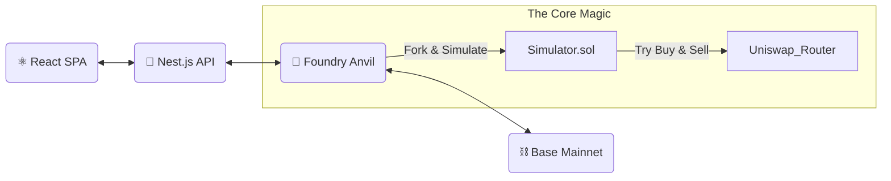

<div align="center">

# 🔨 Chuizi Token Doctor


<pre style="text-align:center; font-family: monospace;">
     ___________
    /          /|    _____  _   _  _   _  _____ 
 /__________/ |   / ____|| | | || | | ||_   _|
 |          | |  | |     | |_| || | | |  | |  
 |          | |  | |___  |  _  || |_| |  | |  
 |__________|/    \_____||_| |_| \___/  |___| 
             ||
             ||             ______   _____
             ||            |___  /  |_   _|
     ____||____           / /     | |  
    /          \         / /      | | 
    |   SMASH   |       / /___   _| |_
    \__________/ .     /______| |_____|

**Smash open the camouflage. See the truth.**
<br/>
**用锤子砸开伪装的外壳，直视土狗的本质**
</pre>

[Live Demo](#) · [Report Bug](#)

<br/>

[ 🇺🇸 English ](#-english) | [ 🇨🇳 中文文档 ](#-中文文档)

</div>

---

### ⚡ What makes "Chuizi" different? (为什么叫锤子？)

Most scanners just **look** at the code (Static Analysis). Scammers can hide traps easily.
<br/>
**Chuizi** doesn't look. **Chuizi hits.**

We fork the Base Mainnet and execute **Real Transactions** in a sandbox.
*   If the sell transaction fails in our simulation, it's a honeypot. 🍯
*   If the balance change shows 50% tax, it's a scam. 💸
*   **We smash the shell to see if there's money inside.**
---

## ⚡ Introduction (简介)

**Chuizi Token Doctor** 不是那些只会在 Etherscan 上读代码的弱鸡扫描器。

我们不猜测，我们 **实战**。

核心原理基于 **Mainnet Forking Simulation**。当你输入一个合约地址时，我们的后端会立即启动一个 Base 主网的平行宇宙（Fork），在这个沙盒里，我们拿真金白银（当然是 Fork 里的假钱）去砸盘、去买入、去卖出。

如果我们在沙盒里无法卖出，那你——在主网上也别想跑掉。

### 🔥 Key Features (核心功能)

- **🧬 真实交易模拟**: 拒绝静态分析误报，直接 fork 主网状态进行原子化交易测试。
- **🍯 貔貅 (Honeypot) 终结者**: 精确检测只能买不能卖、黑名单限制、暂停交易等恶意逻辑。
- **💸 隐形税率侦测**: 很多土狗写着 0 税，实际扣你 50%。我们通过余额变动计算最真实的税率。
- **🚀 极速响应**: 基于 Nest.js + Viem 高性能架构，平均检测耗时 < 3秒。
- **💎 现代化全栈**: React (Vite) 前端 + Nest.js 后端 + Foundry 核心引擎。

---

## 🛠️ Architecture (技术架构)

> "Talk is cheap. Show me the code."


## 🚀 Getting Started (快速开始)

Prerequisites

确保你的环境已经安装了以下神装：

Node.js (v18+)
Foundry (Forge, Cast, Anvil)
pnpm (Recommended)
1. Clone the Repo

git clone https://github.com/yourusername/base-token-doctor.git
cd base-token-doctor
2. Setup Contracts & Simulation Engine

首先，我们需要启动本地的时间屋（Anvil Fork）并部署探测器。

### 终端 A: 启动 Base 主网 Fork
### 记得替换你的 RPC URL (Alchemy / Infura)
anvil --fork-url https://mainnet.base.org --port 8545

### 终端 B: 部署探测合约
cd contracts
forge script script/DeploySimulator.s.sol --rpc-url http://127.0.0.1:8545 --broadcast --private-key 0xac0974bec39a17e36ba4a6b4d238ff944bacb478cbed5efcae784d7bf4f2ff80
### Copy the deployed contract address!
3. Setup Backend (Nest.js)

cd ../backend
pnpm install

### 创建 .env 文件并填入配置
cp .env.example .env
### SIMULATOR_CONTRACT_ADDRESS=你的合约地址
### ANVIL_RPC_URL=http://127.0.0.1:8545

pnpm start:dev
## 4. Setup Frontend (React)

cd ../frontend
pnpm install
pnpm dev
访问 http://localhost:5173，开始你的土狗猎杀之旅。

🧪 How it works (工作原理)

为什么我们的准确率高达 99.9%？因为我们使用了 Simulator.sol。

// 伪代码逻辑展示
function check(address token) external returns (Result) {
    // 1. 尝试在 Uniswap 路由买入
    try router.swapExactETHForTokens(...) {
        // 记录买入税
    } catch {
        return HONEYPOT;
    }

    // 2. 尝试 Approve (很多貔貅死在这一步)
    token.approve(router, ...);

    // 3. 尝试卖出
    try router.swapExactTokensForETH(...) {
        // 记录卖出税
    } catch {
        return HONEYPOT; // 只能进不能出！
    }
}
🤝 Contributing (贡献)

欢迎各路大神提交 PR。如果你发现了新的貔貅套路我们的扫描器没测出来，请务必提交 Issue！

Fork it
Create your feature branch (git checkout -b feature/AmazingFeature)
Commit your changes (git commit -m 'Add some AmazingFeature')
Push to the branch (git push origin feature/AmazingFeature)
Open a Pull Request
📄 License

Distributed under the MIT License. See LICENSE for more information.

<div align="center"> Made with ❤️ by <a href="https://github.com/huicanvie">Canvie</a> </div> ```
