<div align="center">

# 🔨 Chuizi Token Doctor


**Smash open the camouflage. See the truth.**

[ **English** ] | [ [中文文档](./README.zh-CN.md) ]

</div>

---

## 📖 Table of Contents

- [Introduction](#-introduction)
- [Why "Chuizi" (Hammer)?](#-why-chuizi-hammer)
- [Key Features](#-key-features)
- [Architecture](#-architecture)
- [Getting Started](#-getting-started)
- [How It Works](#-how-it-works)
- [Project Structure](#-project-structure)
- [Contributing](#-contributing)
- [License](#-license)

---

## 💡 Introduction

**Chuizi Token Doctor** is not one of those weak scanners that only read code on Etherscan.

We don't guess. We **test in action**.

The core principle is based on **EVM State Override + eth_call technology**. When you input a contract address, we use the state override feature of `eth_call` to temporarily inject our detection contract code into the mainnet environment. We execute buy and sell tests on the real Base mainnet state — **no contract deployment, no gas consumption, yet achieving results identical to real transactions**.

**If we can't sell in the simulation, you won't be able to escape on mainnet either.**

---

## ⚡ Why "Chuizi" (Hammer)?

Most scanners just **look** at the code (Static Analysis). Scammers can easily hide traps.

**Chuizi doesn't look. Chuizi hits.**

We fork the Base Mainnet and execute **Real Transactions** in a sandbox:

- If the sell transaction fails in our simulation, it's a honeypot 🍯
- If the balance change shows 50% tax, it's a scam 💸
- **We smash the shell to see if there's real value inside**

---

## 🔥 Key Features

### 🧬 Real Transaction Simulation
Reject static analysis false positives. Directly fork mainnet state for atomic transaction testing. Test token behavior in a real blockchain environment.

### 🍯 Honeypot Terminator
Precisely detect malicious logic like buy-only tokens, blacklist restrictions, and paused trading. If a token has traps, we'll discover them before you lose money.

### 💸 Hidden Tax Detection
Many scam projects claim 0% tax but actually charge 50%. We calculate the real tax rate through balance changes, exposing hidden fees.

### 🚀 Lightning Fast Response
Based on Nest.js + ethers.js high-performance architecture, average detection time < 3 seconds. Get results quickly to make informed decisions.

### 💎 Modern Full-Stack
- **Frontend**: React + Vite + TypeScript + Tailwind CSS
- **Backend**: Nest.js + ethers.js + TypeScript
- **Contracts**: Solidity + Hardhat

---

## 🛠️ Architecture

> "Talk is cheap. Show me the code."

```mermaid
graph LR
    Client(⚛️ React SPA) <--> API(🦅 Nest.js API)
    API <--> RPC(🌐 Base Mainnet RPC)
    
    subgraph "The Core Magic: State Override"
    API -- "eth_call + code injection" --> Doctor[TokenDoctor.sol]
    Doctor -- "Real buy test" --> Uniswap
    Doctor -- "Real sell test" --> Uniswap
    Doctor -- "Return via revert" --> API
    end
    
    RPC <--> BaseChain(⛓️ Base Mainnet Real-time State)
```



### Tech Stack

| Module | Technology | Description |
|--------|-----------|-------------|
| Frontend | React + Vite + TypeScript | Modern single-page application |
| Backend | Nest.js + ethers.js | Enterprise-grade Node.js framework |
| Contracts | Solidity + Hardhat | Smart contract development & testing |
| Package Manager | pnpm workspace | Monorepo architecture |
| Blockchain | Base Chain (L2) | Low-cost, high-performance |

---

## 🚀 Getting Started

### Prerequisites

Make sure you have the following tools installed:

- **Node.js** (v18+)
- **pnpm** (Recommended) - `npm install -g pnpm`

### 1. Clone the Repository

```bash
git clone https://github.com/huicanvie/chuizi-token-doctor.git
cd chuizi-token-doctor
```

### 2. Install Dependencies

```bash
# Install dependencies for all modules
pnpm install
```

### 3. Compile Smart Contracts

```bash
cd contracts

# Install dependencies
pnpm install

# Compile contracts (to get ABI and Bytecode)
pnpm hardhat compile

# After compilation, artifacts will be generated and loaded by backend
# Note: No contract deployment needed! Code injected via State Override
```

### 4. Configure Backend

```bash
cd backend

# Create .env file
cp .env.example .env

# Edit .env file with the following configuration:
# RPC_URL=https://mainnet.base.org  # Or use Alchemy/Infura Base RPC
# DOCTOR_ADDRESS_PLACEHOLDER=0x0000000000000000000000000000000000000001  # Any address works
# WETH_ADDRESS=0x4200000000000000000000000000000000000006
# UNISWAP_V3_ROUTER=0x2626664c2603336E57B271c5C0b26F421741e481
# UNISWAP_V2_ROUTER=0x4752ba5dbc23f44d87826276bf6fd6b1c372ad24
# SIMULATE_AMOUNT_ETH=0.1
# SENDER=0xf39Fd6e51aad88F6F4ce6aB8827279cffFb92266  # Simulated sender address

# Start development server
pnpm start:dev
```

### 5. Start Frontend

```bash
cd frontend

# Start development server
pnpm dev
```

Visit **http://localhost:5173** and start your scam token hunting journey!

---

## 🧪 How It Works

### Why is our accuracy rate up to 99.9%?

Because we use **EVM State Override** technology with the **TokenDoctor.sol** smart contract to execute simulation transactions on real mainnet state.

### 🔑 Core Technology: State Override

```typescript
// Temporarily inject contract code via eth_call's third parameter
await provider.send('eth_call', [
  {
    from: sender,
    to: doctorAddress,  // any address
    data: txData,
    value: simulationAmount,
  },
  'latest',
  {
    // 🔥 Key: temporarily override the code at this address
    [doctorAddress]: {
      code: doctorBytecode,  // inject detection contract
    },
  },
]);
```

**Technical Advantages:**
- ✅ **No Deployment**: Contract code only in memory, temporarily injected via RPC call
- ✅ **Real State**: Direct connection to Base mainnet, using real-time liquidity pools and token state
- ✅ **Zero Cost**: `eth_call` is read-only, consumes no gas
- ✅ **Lightning Fast**: No waiting for block confirmation, millisecond-level response

### Core Detection Process

```solidity
// Pseudo-code logic demonstration
function simulation(address token) external payable returns (Result) {
    // 1. Try to buy on Uniswap router
    try router.swapExactETHForTokens(...) {
        // Record successful buy, calculate buy tax
        buySuccess = true;
        buyTax = calculateTax(expectedAmount, actualAmount);
    } catch {
        // Buy failed - possible paused trading or blacklist
        return HONEYPOT;
    }

    // 2. Try Approve (many honeypots fail here)
    try token.approve(router, maxAmount) {
        // Approve successful
    } catch {
        return HONEYPOT; // Cannot approve
    }

    // 3. Try to sell
    try router.swapExactTokensForETH(...) {
        // Record successful sell, calculate sell tax
        sellSuccess = true;
        sellTax = calculateTax(expectedETH, actualETH);
    } catch {
        // Can only buy, not sell! Classic honeypot
        return HONEYPOT;
    }

    // 4. Calculate overall tax rate and risk level
    return Result({
        buySuccess: buySuccess,
        sellSuccess: sellSuccess,
        buyTax: buyTax,
        sellTax: sellTax,
        riskLevel: calculateRiskLevel(sellTax)
    });
}
```

### Detection Metrics

| Metric | Description | Risk Rating |
|--------|-------------|-------------|
| Buy Success Rate | Can successfully buy tokens | Fail = 🔴 CRITICAL |
| Sell Success Rate | Can successfully sell tokens | Fail = 🔴 CRITICAL |
| Buy Tax | Actual received tokens vs theoretical | >30% = 🟡 HIGH |
| Sell Tax | Actual received ETH vs theoretical | >30% = 🟡 HIGH |
| Gas Consumption | Transaction gas fees | Abnormally high = 🟡 Warning |

---

## 📁 Project Structure

```
chuizi-token-doctor/
├── frontend/              # React frontend application
│   ├── src/
│   │   ├── components/   # UI components
│   │   ├── pages/        # Pages
│   │   └── utils/        # Utility functions
│   └── package.json
│
├── backend/              # Nest.js backend API
│   ├── src/
│   │   ├── simulation/   # Simulation service
│   │   ├── types/        # Type definitions
│   │   └── main.ts       # Entry file
│   └── package.json
│
├── contracts/            # Solidity smart contracts
│   ├── contracts/
│   │   └── TokenDoctor.sol  # Core detection contract
│   ├── scripts/          # Deployment scripts
│   └── test/             # Contract tests
│
├── pnpm-workspace.yaml   # Monorepo configuration
└── package.json          # Root configuration
```

---

## 🤝 Contributing

We welcome PRs from all developers! If you discover a new honeypot pattern that our scanner didn't catch, please submit an Issue.

### How to Contribute

1. **Fork** this repository
2. Create your feature branch (`git checkout -b feature/AmazingFeature`)
3. Commit your changes (`git commit -m 'Add some AmazingFeature'`)
4. Push to the branch (`git push origin feature/AmazingFeature`)
5. Open a **Pull Request**

### Development Guidelines

- Follow TypeScript and ESLint rules
- Write clear commit messages
- Add tests for new features
- Update relevant documentation

---

## 📄 License

This project is licensed under the **MIT License**. See [LICENSE](./LICENSE) file for details.

---

## 🙏 Acknowledgments

- [Hardhat](https://hardhat.org/) - Ethereum development environment
- [Nest.js](https://nestjs.com/) - Progressive Node.js framework
- [ethers.js](https://docs.ethers.org/) - Ethereum JavaScript library
- [Base](https://base.org/) - Coinbase's L2 solution

---

<div align="center">

Made with ❤️ by [Canvie](https://github.com/huicanvie)

**⚠️ Disclaimer**: This tool is for research and educational purposes only. Investment involves risks, please make decisions carefully.

</div> ```
