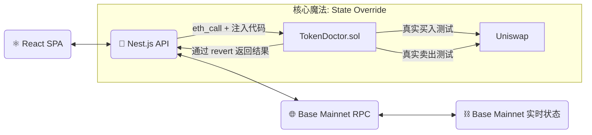

# 🔨 Chuizi Token Doctor (锤子代币医生)

<div align="center">


**用锤子砸开伪装的外壳，直视土狗的本质**

[ [English](./README.md) ] | [ **中文文档** ]

</div>

---

## 📖 目录

- [简介](#-简介)
- [为什么叫"锤子"](#-为什么叫锤子)
- [核心功能](#-核心功能)
- [技术架构](#-技术架构)
- [快速开始](#-快速开始)
- [工作原理](#-工作原理)
- [项目结构](#-项目结构)
- [贡献指南](#-贡献指南)
- [许可证](#-许可证)

---

## 💡 简介

**Chuizi Token Doctor** 不是那些只会在 Etherscan 上读代码的弱鸡扫描器。

我们不猜测，我们 **实战**。

核心原理基于 **EVM State Override + eth_call 技术**。当你输入一个合约地址时，我们通过 `eth_call` 的状态覆盖功能，临时将检测合约代码注入到主网环境中，在真实的 Base 主网状态下执行买入、卖出测试——**无需部署合约，无需消耗 Gas，却能获得与真实交易完全一致的结果**。

**如果我们在模拟中无法卖出，那你——在主网上也别想跑掉。**

---

## ⚡ 为什么叫"锤子"？

大部分扫描器只是 **看** 代码（静态分析）。骗子们可以轻松隐藏陷阱。

**锤子不看。锤子直接砸。**

我们分叉 Base 主网并在沙盒中执行 **真实交易**：

- 如果卖出交易在我们的模拟中失败，那就是貔貅（蜜罐）🍯
- 如果余额变化显示 50% 的税，那就是骗局 💸
- **我们砸开外壳，看看里面到底有没有真金白银**

---

## 🔥 核心功能

### 🧬 真实交易模拟
拒绝静态分析误报，直接 fork 主网状态进行原子化交易测试。在真实的区块链环境下测试代币行为。

### 🍯 貔貅（Honeypot）终结者
精确检测只能买不能卖、黑名单限制、暂停交易等恶意逻辑。如果代币有陷阱，我们会在你损失之前发现它。

### 💸 隐形税率侦测
很多土狗项目声称 0 税，实际却扣你 50%。我们通过余额变动计算最真实的税率，揭露隐藏的费用。

### 🚀 极速响应
基于 Nest.js + ethers.js 高性能架构，平均检测耗时 < 3秒。快速得出结果，让你第一时间做出决策。

### 💎 现代化全栈
- **前端**: React + Vite + TypeScript + Tailwind CSS
- **后端**: Nest.js + ethers.js + TypeScript
- **合约**: Solidity + Hardhat

---

## 🛠️ 技术架构

> "Talk is cheap. Show me the code."



### 技术栈

| 模块 | 技术 | 说明 |
|------|------|------|
| 前端 | React + Vite + TypeScript | 现代化单页应用 |
| 后端 | Nest.js + ethers.js | 企业级 Node.js 框架 |
| 合约 | Solidity + Hardhat | 智能合约开发与测试 |
| 包管理 | pnpm workspace | Monorepo 架构 |
| 区块链 | Base Chain (L2) | 低成本、高性能 |

---

## 🚀 快速开始

### 环境要求

确保你的环境已经安装了以下工具：

- **Node.js** (v18+)
- **pnpm** (推荐) - `npm install -g pnpm`

### 1. 克隆仓库

```bash
git clone https://github.com/huicanvie/chuizi-token-doctor.git
cd chuizi-token-doctor
```

### 2. 安装依赖

```bash
# 安装所有模块的依赖
pnpm install
```

### 3. 编译智能合约

```bash
cd contracts

# 安装依赖
pnpm install

# 编译合约（获取 ABI 和 Bytecode）
pnpm hardhat compile

# 合约编译后会生成 artifacts 文件，后端会自动加载
# 注意：无需部署合约！代码会通过 State Override 注入
```

### 4. 配置后端

```bash
cd backend

# 创建 .env 文件
cp .env.example .env

# 编辑 .env 文件，填入以下配置：
# RPC_URL=https://mainnet.base.org  # 或使用 Alchemy/Infura 的 Base RPC
# DOCTOR_ADDRESS_PLACEHOLDER=0x0000000000000000000000000000000000000001  # 任意地址即可
# WETH_ADDRESS=0x4200000000000000000000000000000000000006
# UNISWAP_V3_ROUTER=0x2626664c2603336E57B271c5C0b26F421741e481
# UNISWAP_V2_ROUTER=0x4752ba5dbc23f44d87826276bf6fd6b1c372ad24
# SIMULATE_AMOUNT_ETH=0.1
# SENDER=0xf39Fd6e51aad88F6F4ce6aB8827279cffFb92266  # 模拟发送者地址

# 启动开发服务器
pnpm start:dev
```

### 5. 启动前端

```bash
cd frontend

# 启动开发服务器
pnpm dev
```

访问 **http://localhost:5173**，开始你的土狗猎杀之旅！

---

## 🧪 工作原理

### 为什么我们的准确率高达 99.9%？

因为我们使用了 **EVM State Override** 技术配合 **TokenDoctor.sol** 智能合约，在真实主网状态下执行模拟交易。

### 🔑 核心技术：State Override

```typescript
// 通过 eth_call 的第三个参数临时注入合约代码
await provider.send('eth_call', [
  {
    from: sender,
    to: doctorAddress,  // 任意地址
    data: txData,
    value: simulationAmount,
  },
  'latest',
  {
    // 🔥 关键：临时覆盖该地址的代码
    [doctorAddress]: {
      code: doctorBytecode,  // 注入检测合约
    },
  },
]);
```

**技术优势：**
- ✅ **无需部署**：合约代码仅在内存中，通过 RPC 调用临时注入
- ✅ **真实状态**：直连 Base 主网，使用实时的流动性池和代币状态
- ✅ **零成本**：`eth_call` 是只读调用，不消耗 Gas
- ✅ **极速响应**：无需等待区块确认，毫秒级返回结果

### 核心检测流程

```solidity
// 伪代码逻辑展示
function simulation(address token) external payable returns (Result) {
    // 1. 尝试在 Uniswap 路由买入
    try router.swapExactETHForTokens(...) {
        // 记录买入成功，计算买入税
        buySuccess = true;
        buyTax = calculateTax(expectedAmount, actualAmount);
    } catch {
        // 买入失败 - 可能是暂停交易或黑名单
        return HONEYPOT;
    }

    // 2. 尝试 Approve (很多貔貅死在这一步)
    try token.approve(router, maxAmount) {
        // Approve 成功
    } catch {
        return HONEYPOT; // 无法授权
    }

    // 3. 尝试卖出
    try router.swapExactTokensForETH(...) {
        // 记录卖出成功，计算卖出税
        sellSuccess = true;
        sellTax = calculateTax(expectedETH, actualETH);
    } catch {
        // 只能进不能出！典型的貔貅
        return HONEYPOT;
    }

    // 4. 计算总体税率和风险等级
    return Result({
        buySuccess: buySuccess,
        sellSuccess: sellSuccess,
        buyTax: buyTax,
        sellTax: sellTax,
        riskLevel: calculateRiskLevel(sellTax)
    });
}
```

### 检测指标

| 指标 | 说明 | 风险评级 |
|------|------|---------|
| 买入成功率 | 是否能成功买入代币 | 失败 = 🔴 CRITICAL |
| 卖出成功率 | 是否能成功卖出代币 | 失败 = 🔴 CRITICAL |
| 买入税率 | 实际收到的代币 vs 理论应得 | >30% = 🟡 HIGH |
| 卖出税率 | 实际收到的 ETH vs 理论应得 | >30% = 🟡 HIGH |
| Gas 消耗 | 交易的 Gas 费用 | 异常高 = 🟡 警告 |

---

## 📁 项目结构

```
chuizi-token-doctor/
├── frontend/              # React 前端应用
│   ├── src/
│   │   ├── components/   # UI 组件
│   │   ├── pages/        # 页面
│   │   └── utils/        # 工具函数
│   └── package.json
│
├── backend/              # Nest.js 后端 API
│   ├── src/
│   │   ├── simulation/   # 模拟服务
│   │   ├── types/        # 类型定义
│   │   └── main.ts       # 入口文件
│   └── package.json
│
├── contracts/            # Solidity 智能合约
│   ├── contracts/
│   │   └── TokenDoctor.sol  # 核心检测合约
│   ├── scripts/          # 部署脚本
│   └── test/             # 合约测试
│
├── pnpm-workspace.yaml   # Monorepo 配置
└── package.json          # 根配置
```

---

## 🤝 贡献指南

欢迎各路大神提交 PR！如果你发现了新的貔貅套路而我们的扫描器没测出来，请务必提交 Issue。

### 如何贡献

1. **Fork** 本仓库
2. 创建你的特性分支 (`git checkout -b feature/AmazingFeature`)
3. 提交你的更改 (`git commit -m 'Add some AmazingFeature'`)
4. 推送到分支 (`git push origin feature/AmazingFeature`)
5. 开启一个 **Pull Request**

### 开发规范

- 遵循 TypeScript 和 ESLint 规则
- 编写清晰的提交信息
- 为新功能添加测试
- 更新相关文档

---

## 📄 许可证

本项目采用 **MIT License** 开源。详见 [LICENSE](./LICENSE) 文件。

---

## 🙏 致谢

- [Hardhat](https://hardhat.org/) - 以太坊开发环境
- [Nest.js](https://nestjs.com/) - 渐进式 Node.js 框架
- [ethers.js](https://docs.ethers.org/) - 以太坊 JavaScript 库
- [Base](https://base.org/) - Coinbase 的 L2 解决方案

---

<div align="center">

Made with ❤️ by [Canvie](https://github.com/huicanvie)

**⚠️ 免责声明**: 本工具仅供研究和教育目的。投资有风险，请谨慎决策。

</div>
